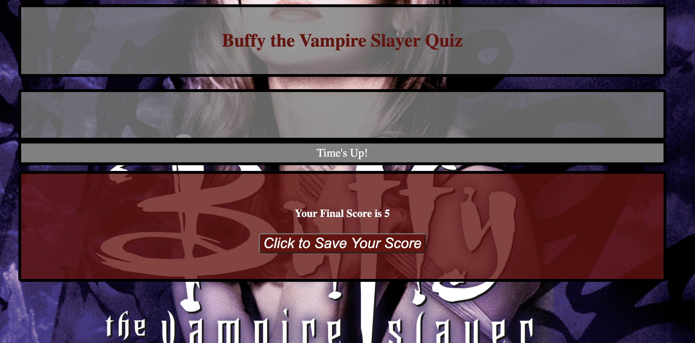

# Buffy the Vampire Slayer Trivia Challenge

Welcome to the Buffy the Vampire Slayer Trivia Challenge! Test your knowlege of the Buffy-verse with this intractive quiz game.

## Description

This quiz is designed to challenge your knowledge of the Buffy the Vampire Slayer series. Do you have what it takes to prove your worthiness to the Watcher's Council? Click the "Start Quiz" button to find out!

## Getting Started

To get started, simply open the `index.html` file in your preferred web browser. The quiz will display questions related to the Buffy series, and you'll have the chance to select the correct answers.

You may also access the deployed version of this application at 

## Game Features

- **Timer:** Players have a total of 70 seconds to answer as many questions as possible. Players have a limited amount of time to answer each question. Incorrect answers will deduct 10 seconds from the remaining time.

- **Score Tracking:** The current score is visible throughout the quiz.

- **Sound Effects:** Enjoy correct and incorrect sound effects as you progress through the quiz.
- **High Scores:** Save your final score and compete for a spot on the leaderboard!

## How to Play

1. Click the "Start Quiz" button to begin.
2. Read each question carefully.
3. Select the answer you believe is correct.
4. Receive instant feedback on your answer. Incorrect answers will cost you 10 seconds!
5. Keep an eye on the timer!
6. Record your score and compare to other potential slayers! 

## High Scores

After completing the quiz, you'll have the option to save your score and view the top 10 high scores. Will you make it to the leaderboard?

## Installation

To install and run the quiz locally, follow these steps:

1. Clone this repository to your local machine.
2. Open the `index.html` file in your preferred web browser.

## Usage

Feel free to use and modify this quiz for your personal enjoyment or educational purposes.

## Authors

- Bradley Troll, bradleytroll@gmail.com

Good luck, potential slayer!

---

*Note: Buffy the Vampire Slayer and its related content are the property of their respective owners.*

